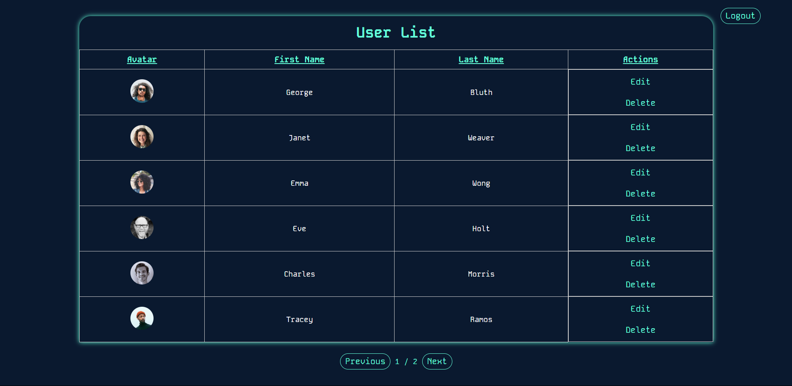
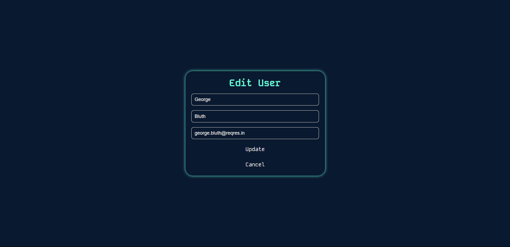

# EmployWise 💼 - React User Management Application 🧑‍💻

This is a React application that integrates with the Reqres API to perform basic user management functions, including authentication 🔑, user listing 📋, editing ✏️, and deletion 🗑️.

**Live Demo:** [https://employ-wise-pi.vercel.app/](https://employ-wise-pi.vercel.app/) 🚀

## Features ✨

* **Authentication:** 🔐
    * User login using email and password. 📧🔑
    * Token-based authentication. 🔑
    * Token persistence using local storage. 💾
    * Error handling for invalid credentials. ❌
* **User Listing:** 📋
    * Paginated list of users. 📄➡️
    * Display of user avatar 🖼️, first name 🏷️, and last name 🏷️.
* **User Management:** 🛠️
    * Edit user details (first name, last name, email). ✏️
    * Delete users. 🗑️
    * Display success or error messages after operations. ✅/❌

## Technologies Used 💻

* **React:** Frontend framework. ⚛️
* **Axios:** HTTP client for API requests. 🌐
* **CSS:** Custom CSS for styling. 🎨
* **Vite:** Build tool. ⚡

## Setup Instructions 🛠️

1.  **Clone the repository:** 📥

    ```bash
    git clone https://github.com/SamP231004/EmployWise
    cd EmployWise
    ```

2.  **Install dependencies:** 📦

    ```bash
    npm install
    ```

3.  **Run the application:** 🏃

    ```bash
    npm run dev
    ```

4.  **Open the application in your browser:** 🌐

    * The application will be available at `http://localhost:5173/` (or the port Vite specifies).

## API Endpoint 🔗

* **Base URL:** `https://reqres.in/api` 🌐
* **Login:** `POST /api/login` 🔑
* **User Listing:** `GET /api/users` 📋
* **User Update:** `PUT /api/users/{id}` ✏️
* **User Delete:** `DELETE /api/users/{id}` 🗑️

## Login Credentials 🔑

* **Email:** `eve.holt@reqres.in` 📧
* **Password:** `cityslicka` 🔑

## Screen Shots 📸

**Login Screen:** 🔑


**User List Screen:** 📋



**Edit User Screen:** ✏️

